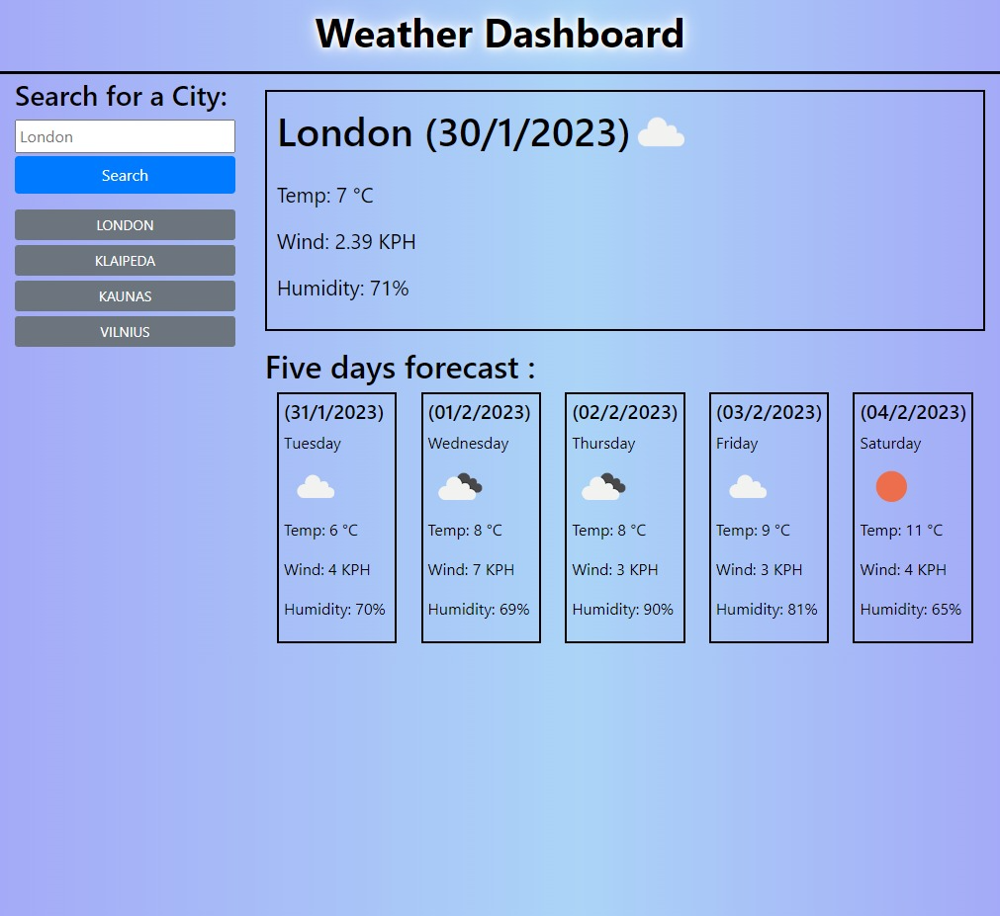

# Weather forecast app

## Description

In this app I was using third party API (OpenWeather) to get weeks weather forecast for user inputed city.

Link to live page: [Click here](https://markubil.github.io/weather-forecast/)

## Installation

N/A

## Usage

In this project I was using jQuary, Bootstrap and Moment. It send request to OpenWeather API to get weather data for a week.

## Credits

N/A

## License

 GNU GENERAL PUBLIC LICENSE

 Version 3, 29 June 2007

 Copyright (C) 2007 Free Software Foundation, Inc. <https://fsf.org/>
 Everyone is permitted to copy and distribute verbatim copies
 of this license document, but changing it is not allowed.

## Badges

